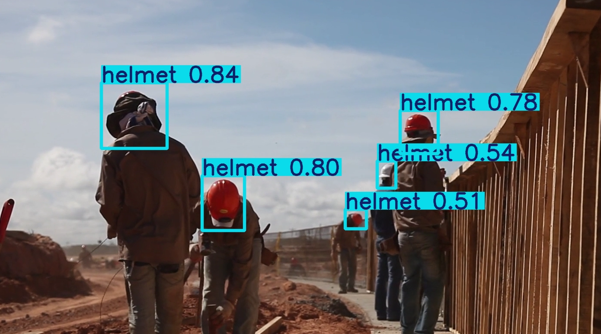

# PPE Detector

Real-time Personal Protective Equipment (PPE) detection using YOLOv8, fine-tuned on construction site images.



## Results

Trained for 30 epochs on the [Hard Hat Universe](https://universe.roboflow.com/workspace-epi/hard-hat-universe-0dy7t-tbkpp/dataset/1) dataset (7036 images, 640×640).

| Class | mAP50 | mAP50-95 |
|-------|-------|----------|
| helmet | 0.98 | 0.69 |
| head (no helmet) | 0.95 | 0.67 |
| **all** | **0.65** | **0.46** |

> Overall mAP is pulled down by underrepresented classes (`person`, `hi-viz vest`) in the dataset. Core detection (helmet vs. unprotected head) performs at 95–98% mAP50.

## Setup

```bash
python -m venv venv
source venv/Scripts/activate  # Windows: venv\Scripts\activate
pip install -r requirements.txt
```

## Usage

**Train:**
```bash
python train.py
```

**Run on video:**
```bash
python detect.py --source path/to/video.mp4
```

**Run on webcam:**
```bash
python detect.py
```

## Dataset

[Hard Hat Universe](https://universe.roboflow.com/workspace-epi/hard-hat-universe-0dy7t-tbkpp/dataset/1) via Roboflow — Public Domain.
Classes: `head`, `helmet`, `hi-viz helmet`, `hi-viz vest`, `person`, `random`.

## Demo video credit

[Construction Workers Doing the Road](https://www.pexels.com/video/construction-workers-doing-the-road-2048246/) by Pexels (free to use).

## License

MIT
